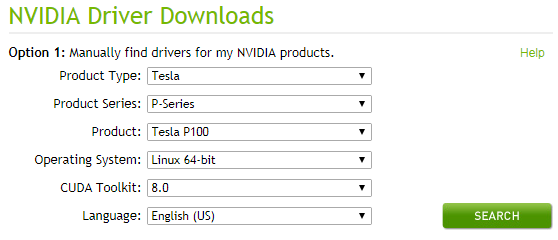

# p1服务器安装NVIDIA GPU驱动和CUDA工具包<a name="bms_01_0050"></a>

## 操作场景<a name="section263791112917"></a>

GPU加速型p1（physical.p1.large规格）裸金属服务器创建成功后，需安装NVIDIA GPU驱动和CUDA工具包，从而实现计算加速功能。

## 前提条件<a name="section9977817203914"></a>

-   已绑定弹性公网IP。
-   已下载对应操作系统所需驱动的安装包。

    **表 1**  NVIDIA GPU驱动和CUDA工具包下载

    <a name="table3347208202718"></a>
    <table><thead align="left"><tr id="row134516872719"><th class="cellrowborder" valign="top" width="23.232323232323235%" id="mcps1.2.4.1.1"><p id="p19345188102715"><a name="p19345188102715"></a><a name="p19345188102715"></a>操作系统</p>
    </th>
    <th class="cellrowborder" valign="top" width="35.35353535353536%" id="mcps1.2.4.1.2"><p id="p134568142716"><a name="p134568142716"></a><a name="p134568142716"></a>需要下载的驱动</p>
    </th>
    <th class="cellrowborder" valign="top" width="41.41414141414141%" id="mcps1.2.4.1.3"><p id="p1434511872719"><a name="p1434511872719"></a><a name="p1434511872719"></a>下载地址</p>
    </th>
    </tr>
    </thead>
    <tbody><tr id="row0345208172718"><td class="cellrowborder" rowspan="2" valign="top" width="23.232323232323235%" headers="mcps1.2.4.1.1 "><p id="p1834518122713"><a name="p1834518122713"></a><a name="p1834518122713"></a>Ubuntu 16.04、CentOS 7.4</p>
    </td>
    <td class="cellrowborder" valign="top" width="35.35353535353536%" headers="mcps1.2.4.1.2 "><p id="p113450817274"><a name="p113450817274"></a><a name="p113450817274"></a>NVIDIA GPU驱动安装包“NVIDIA-Linux-x86_64-375.66.run”</p>
    </td>
    <td class="cellrowborder" valign="top" width="41.41414141414141%" headers="mcps1.2.4.1.3 "><p id="p1034578142717"><a name="p1034578142717"></a><a name="p1034578142717"></a><a href="https://www.nvidia.com/download/driverResults.aspx/118955/en-us" target="_blank" rel="noopener noreferrer">https://www.nvidia.com/download/driverResults.aspx/118955/en-us</a></p>
    </td>
    </tr>
    <tr id="row10347128122713"><td class="cellrowborder" valign="top" headers="mcps1.2.4.1.1 "><p id="p934514819274"><a name="p934514819274"></a><a name="p934514819274"></a>CUDA工具包安装包“cuda_8.0.61_375.26_linux.run”</p>
    </td>
    <td class="cellrowborder" valign="top" headers="mcps1.2.4.1.2 "><p id="p83467882717"><a name="p83467882717"></a><a name="p83467882717"></a><a href="https://developer.nvidia.com/compute/cuda/8.0/Prod2/local_installers/cuda_8.0.61_375.26_linux-run" target="_blank" rel="noopener noreferrer">https://developer.nvidia.com/compute/cuda/8.0/Prod2/local_installers/cuda_8.0.61_375.26_linux-run</a></p>
    </td>
    </tr>
    </tbody>
    </table>


不同的操作系统，安装NVIDIA GPU驱动和CUDA工具包的操作略有不同，具体如下：

## CentOS 7.4安装操作<a name="section1367919318"></a>

1.  登录裸金属服务器，执行以下命令，切换至root权限。

    **su** **root**

2.  （可选）如果不存在依赖包**gcc**、**gcc-c++**、**make**和**kernel-devel**，请执行以下命令进行安装。

    **yum** **install** **gcc**

    **yum** **install** **gcc-c++**

    **yum** **install** **make**

    **yum** **install** ****kernel-devel-\`uname**** ****-r\`****

3.  （可选）将Nouveau驱动列入黑名单。

    如果已经安装并加载了Nouveau的显卡驱动，请执行以下操作将Nouveau驱动列入黑名单以避免冲突。

    1.  编辑“/etc/modprobe.d/blacklist.conf”，在文件后面添加**blacklist** **nouveau**。
    2.  运行以下命令备份与重建initramfs：

        **mv** **/boot/initramfs-$\(uname** **-r\).img** **/boot/initramfs-$\(uname** **-r\).img.bak**

        **dracut** **-v** **/boot/initramfs-$\(uname** **-r\).img** **$\(uname** **-r\)**

    3.  重启：**reboot**。

4.  （可选）如果X服务正在运行，请执行**systemctl** **set-default** **multi-user.target**命令并重启裸金属服务器以进入多用户模式。
5.  （可选）安装NVIDIA GPU驱动。

    如果选择了特定版本的NVIDIA GPU驱动，而不是捆绑在CUDA工具包中的版本，则需要执行此步骤。

    1.  下载NVIDIA GPU驱动安装包**NVIDIA-Linux-x86\_64-**_xxx.yy_**.run**（下载链接：[https://www.nvidia.com/Download/index.aspx?lang=en](https://www.nvidia.com/Download/index.aspx?lang=en)），并将该安装包上传至裸金属服务器的“/tmp”目录下。

        **图 1**  搜索NVIDIA驱动包（CentOS 7.4）<a name="fig84466243358"></a>  
        

    2.  执行以下命令，安装NVIDIA GPU驱动。

        **sh** **./NVIDIA-Linux-x86\_64-**_xxx.yy_**.run**

    3.  执行以下命令，删除安装包。

        **rm** **-f** **NVIDIA-Linux-x86\_64-**_xxx.yy_**.run**

6.  安装CUDA工具包。
    1.  下载CUDA Toolkit安装包**cuda\_**_a.b.cc\_xxx.yy_**\_linux.run**（下载链接：[https://developer.nvidia.com/cuda-downloads](https://developer.nvidia.com/cuda-downloads)），并将该安装包上传至裸金属服务器的“/tmp”目录下。
    2.  执行以下命令，修改安装包的权限。

        **chmod** **+x** ****cuda\_****_a.b.cc\_xxx.yy_****\_linux.run****

    3.  执行以下命令，安装CUDA工具包。

        **./**cuda\_****_a.b.cc\_xxx.yy_****\_linux.run**** **-toolkit** **-samples** **-silent** **-override** **--tmpdir=/tmp/**

    4.  执行以下命令，删除安装包。

        **rm** **-f** **cuda**_**\_**a.b.cc\_xxx.yy_**\_linux.run**

    5.  执行如下三条命令，验证是否安装成功。

        **cd** **/usr/local/cuda/samples/1\_Utilities/deviceQueryDrv/**

        **make**

        **./deviceQueryDrv**

        回显信息中包含“Result = PASS”，表示CUDA工具包和NVIDIA GPU驱动安装成功。


## Ubuntu 16.04安装操作<a name="section108130370"></a>

1.  登录裸金属服务器，执行以下命令，切换至root权限。

    **sudo** **root**

2.  （可选）如果不存在依赖包**gcc**、**g++**和**make**，请执行以下命令进行安装。

    **apt-get** **install** **gcc**

    ****apt-get**** **install** **g++**

    ****apt-get**** **install** **make**

3.  （可选）将Nouveau驱动列入黑名单。

    如果已经安装并加载了Nouveau的显卡驱动，请执行以下操作将Nouveau驱动列入黑名单以避免冲突。

    1.  编辑“/etc/modprobe.d/blacklist.conf”，在文件后面加入以下内容：

        ```
        blacklist nouveau
        options nouveau modeset=0
        ```

    2.  执行以下命令备份与重建initramfs：

        **mv** **/boot/initramfs-$\(uname** **-r\).img** **/boot/initramfs-$\(uname** **-r\).img.bak**

        **sudo** **update-initramfs** **-u**

    3.  重启：**sudo** **reboot**

4.  （可选）如果X服务正在运行，请执行**systemctl** **set-default** **multi-user.target**命令并重启裸金属服务器以进入多用户模式。
5.  （可选）安装NVIDIA GPU驱动。

    如果选择了特定版本的NVIDIA GPU驱动，而不是捆绑在CUDA工具包中的版本，则需要执行此步骤。

    1.  下载NVIDIA GPU驱动安装包**NVIDIA-Linux-x86\_64-**_xxx.yy_**.run**（下载链接：[https://www.nvidia.com/Download/index.aspx?lang=en](https://www.nvidia.com/Download/index.aspx?lang=en)），并将该安装包上传至裸金属服务器的“/tmp”目录下。

        **图 2**  搜索NVIDIA驱动包（Ubuntu 16.04）<a name="fig1963645143612"></a>  
        

    2.  执行以下命令，安装NVIDIA GPU驱动。

        **sh** **./NVIDIA-Linux-x86\_64-**_xxx.yy_**.run**

    3.  执行以下命令，删除安装包。

        **rm** **-f** **NVIDIA-Linux-x86\_64-**_xxx.yy_**.run**

6.  安装CUDA工具包。
    1.  下载CUDA Toolkit安装包**cuda\_**_a.b.cc\_xxx.yy_**\_linux.run**（下载链接：[https://developer.nvidia.com/cuda-downloads](https://developer.nvidia.com/cuda-downloads)），并将该安装包上传至裸金属服务器的“/tmp”目录下。
    2.  执行以下命令，修改安装包的权限。

        **chmod** **+x** ****cuda\_****_a.b.cc\_xxx.yy_**\_linux.run**

    3.  执行以下命令，安装CUDA工具包。

        **./**cuda\_****_a.b.cc\_xxx.yy_****\_linux.run**** **-toolkit** **-samples** **-silent** **-override** **--tmpdir=/tmp/**

    4.  执行以下命令，删除安装包。

        **rm** **-f** **cuda**_**\_**a.b.cc\_xxx.yy_**\_linux.run**

    5.  执行如下三条命令，验证是否安装成功。

        **cd** **/usr/local/cuda/samples/1\_Utilities/deviceQueryDrv/**

        **make**

        **./deviceQueryDrv**

        回显信息中包含“Result = PASS”，表示CUDA工具包和NVIDIA GPU驱动安装成功。


