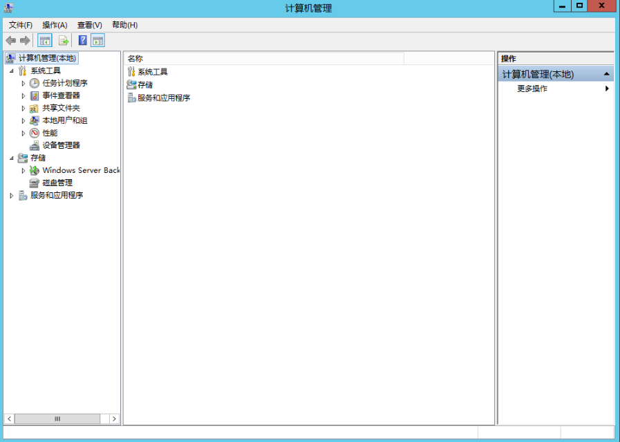
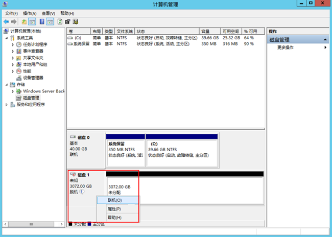
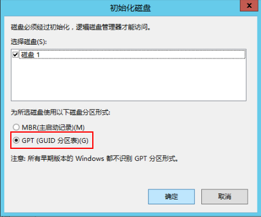
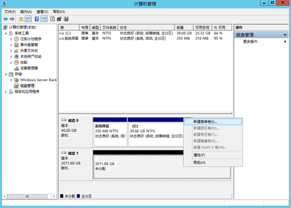
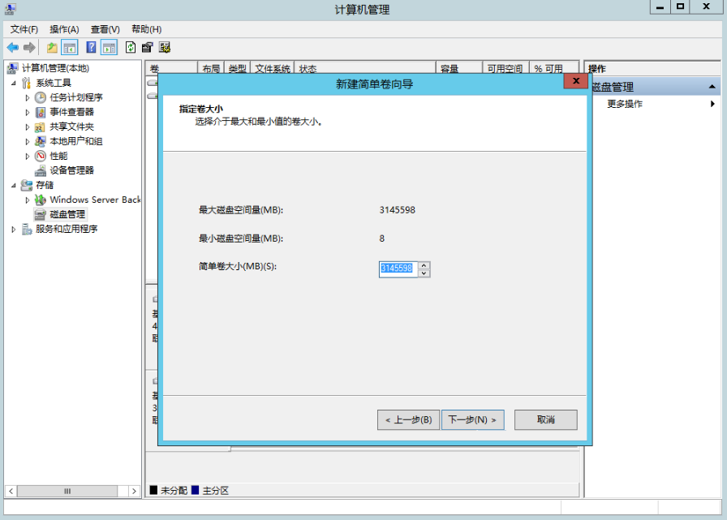
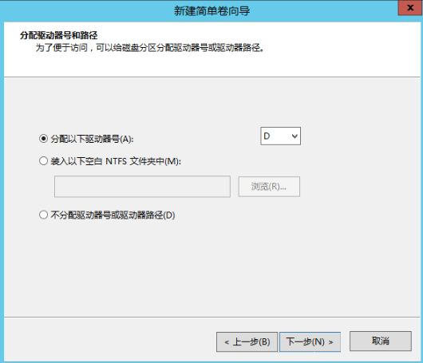
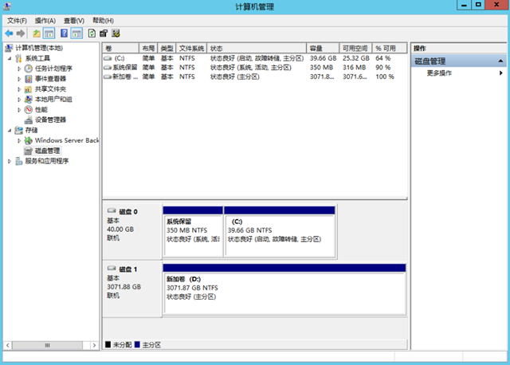
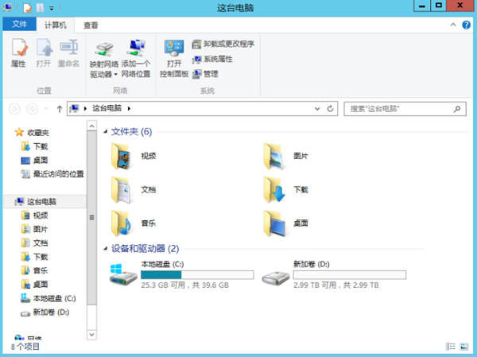

# 初始化容量大于2TB的Windows数据盘（Windows 2012）

## 操作场景

本文以裸金属服务器的操作系统为“Windows Server 2012 R2 Standard 64bit”、云硬盘容量为3 TB举例，提供容量大于2 TB的Windows数据盘的初始化操作指导。

MBR格式分区支持的磁盘最大容量为2 TB，GPT分区表最大支持的磁盘容量为18 EB，因此当为容量大于2 TB的磁盘分区时，请采用GPT分区方式。关于磁盘分区形式的更多介绍，请参见[初始化数据盘场景及磁盘分区形式介绍](初始化数据盘场景及磁盘分区形式介绍.md)。

不同服务器的操作系统的格式化操作可能不同，本文仅供参考，具体操作步骤和差异请参考对应的服务器操作系统的产品文档。

> **注意：** 
>首次使用云磁盘时，如果您未参考本章节对磁盘执行初始化操作，主要包括创建分区和文件系统等操作，那么当后续扩容磁盘时，新增容量部分的磁盘可能无法正常使用。

## 前提条件

-   已登录裸金属服务器。
-   已挂载数据盘至裸金属服务器，且该数据盘未初始化。

## 操作指导

1.  在裸金属服务器桌面，单击桌面下方的。

    弹出“服务器管理器”窗口，如[图1](#zh-cn_topic_0117871091_fig3291745102218)所示。

    **图 1**  服务器管理器（Windows 2012）  
    

2.  在“服务器管理器”页面右上方选择“工具 \> 计算机管理”。

    弹出“计算机管理”窗口，如[图2](#zh-cn_topic_0117871091_fig11577433192617)所示。

    **图 2**  计算机管理  
    

3.  选择“存储 \> 磁盘管理”。

    进入磁盘列表页面，如[图3](#zh-cn_topic_0117871091_fig11358119588)所示。

    **图 3**  磁盘列表  
    

4.  在页面右侧可以查看磁盘列表，若新增磁盘处于脱机状态，需要先进行联机，再进行初始化。

    在磁盘1区域，右键单击菜单列表中的“联机”。

    如[图4](#zh-cn_topic_0117871091_fig6384151112273)所示，当磁盘1由“脱机”状态变为“没有初始化”，表示联机成功。

    **图 4**  联机成功（Windows 2012）  
    

5.  在磁盘1区域，右键单击菜单列表中的“初始化磁盘”。

    弹出“初始化磁盘”窗口，如[图5](#zh-cn_topic_0117871091_fig18619113093116)所示。

    **图 5**  初始化磁盘（Windows 2012）  
    

6.  在“初始化磁盘”对话框中显示需要初始化的磁盘，对于大于2 TB的磁盘，此处请选择“GPT（GUID分区表）”，单击“确定”。

    返回“计算机管理”窗口，如[图6](#zh-cn_topic_0117871091_fig68332918241)所示。

    **图 6**  计算机管理（Windows 2012）  
    

    > **注意：** 
    >MBR支持的磁盘最大容量为2 TB，GPT最大支持的磁盘容量为18 EB，当前数据盘支持的最大容量为32 TB，如果您需要使用大于2 TB的磁盘容量，分区形式请采用GPT。
    >当磁盘已经投入使用后，此时切换磁盘分区形式时，磁盘上的原有数据将会清除，因此请在磁盘初始化时谨慎选择磁盘分区形式。

7.  在磁盘1右侧的未分配的区域，右键单击选择选择“新建简单卷”。

    弹出“新建简单卷向导”窗口，如[图7](#zh-cn_topic_0117871091_fig19509202633615)所示。

    **图 7**  新建简单卷向导（Windows 2012）  
    

8.  根据界面提示，单击“下一步”。

    进入“指定卷大小”页面，如[图8](#zh-cn_topic_0117871091_fig209619215384)所示。

    **图 8**  指定卷大小（Windows 2012）  
    

9.  指定卷大小，系统默认卷大小为最大值，您还可以根据实际需求指定卷大小，此处以保持系统默认配置为例，单击“下一步”。

    进入“分配驱动器号和路径”页面，如[图9](#zh-cn_topic_0117871091_fig631143204114)所示。

    **图 9**  分配驱动器号和路径（Windows 2012）  
    

10. 分配到驱动器号和路径，系统默认为磁盘分配驱动器号，驱动器号默认为“D”，此处以保持系统默认配置为例，单击“下一步”。

    进入“格式化分区”页面，如[图10](#zh-cn_topic_0117871091_fig1400313143015)所示。

    **图 10**  格式化分区（Windows 2012）  
    

11. 格式化分区，系统默认的文件系统为NTFS，并根据实际情况设置其他参数，此处以保持系统默认设置为例，单击“下一步”。

    进入“完成新建卷”页面，如[图11](#zh-cn_topic_0117871091_fig380162213463)所示。

    **图 11**  完成新建卷（Windows 2012）  
    

    > **说明：** 
    >不同文件系统支持的分区大小不同，请根据您的业务需求选择合适的文件系统。

12. 单击“完成”。

    需要等待片刻让系统完成初始化操作，当卷状态为“状态良好”时，表示初始化磁盘成功，如[图12](#zh-cn_topic_0117871091_fig14464150329)所示。

    **图 12**  初始化磁盘成功（Windows 2012）  
    

13. 新建卷完成后，单击，在文件资源管理器中查看是否有新建卷，此处以“新建卷（D:）”为例。

    若如[图13](#zh-cn_topic_0117871091_fig4958111374510)所示，可以看到“新建卷（D:）”，表示磁盘初始化成功，任务结束。

    **图 13**  文件资源管理器（Windows 2012）  
    

