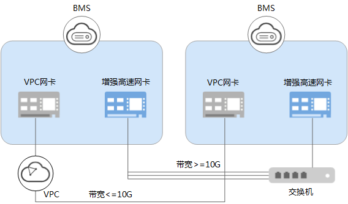
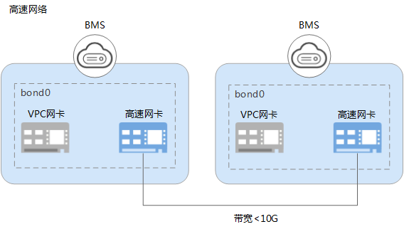
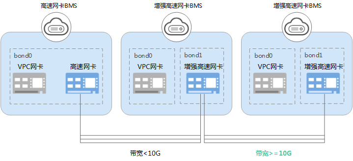

# 增强高速网络概述

## 高速网络介绍

高速网络是裸金属服务器的内部网络，与VPC共享一个物理平面，用户通过管理控制台创建高速网络后，系统会在裸金属服务器操作系统中建立一个专有的vlan子接口，提供网络数据通信。使用10G port。高速网络只有东西流量，且没有三层路由功能，用于节点间内部二层通信。

高速网络相关配置请参见[管理增强高速网络](管理增强高速网络.md)。

## 查看方式

高速网络的网络接口可以在管理控制台中查看（裸金属服务器详情页“网卡”页签下，如[图1](#fig1664319151649)所示），也可以根据分配的IP地址在Linux系统中找到对应的vlan子接口或bond接口。

**图 1**  查看高速网卡  

以SUSE Linux  Enterprise Server 11 SP4为例，登录到系统中，在“/etc/sysconfig/network”目录下可以看到以下网卡配置文件：ifcfg-eth0，ifcfg-eth1，ifcfg-bond0，ifcfg-bond0.2976，ifcfg-bond0.3056，ifcfg-bond0.3057，用户需要通过IP映射来匹配网络。可以看出，ifcfg-bond0.3056，ifcfg-bond0.3057为高速网卡配置文件。

各网卡和bond配置文件的配置信息如下：

## 增强高速网络介绍

> **说明：**   
>增强高速网络目前仅在华南-广州区域上线。  

**图 2**  增强高速网络架构  

增强高速网络通过华为云数据中心实现内网互通互连，可以提供高质量、高速度、低时延的内网环境。具有如下特点：

-   高速带宽内部互联网络
-   客户可灵活自定义的内部网络
-   端口总带宽大于10GE

增强高速网络基于上一代高速网络进行了软硬件的优化升级，使租户的裸金属服务器可以跨POD互通。[图3](#fig13641102313482)为上一代高速网络架构，[图4](#fig127306919469)为上一代高速网络和增强高速网络对比图。

**图 3**  上一代高速网络架构  

**图 4**  两代高速网络对比  

相比上一代高速网络，增强高速网络具有如下三大优势：

-   带宽提升至10GE及以上。
-   租户自定义网络平面数量，最多支持4K个子网。
-   支持裸金属服务器虚拟化访问外网。

## 增强高速网卡使用场景

增强高速网卡的主要有以下使用场景：

-   场景一：组bond

    组bond使用时，可以根据网络规划需求选择不配置vlan或者配置vlan。

    -   不配置vlan

        如果不需要vlan，则可以在配置bond口时，直接配置IP地址和子网掩码。配置完成后，同一网络下的增强高速网卡即可相互通信。

    -   配置vlan

        如果网络规划需要配置vlan，则可以在配置bond口后，再配置相应vlan子接口。

-   场景二：不组bond

    不组bond直接使用时，不可以配置vlan，直接配置IP地址和子网掩码。配置完成后，同一网络下的增强高速网卡即可相互通信。

    > **说明：**   
    >一张增强高速网卡也可以组bond使用。  

[配置增强高速网卡（SUSE Linux Enterprise Server 12 系列）](配置增强高速网卡（SUSE-Linux-Enterprise-Server-12-系列）.md)\~[配置增强高速网卡（Windows Server系列）](配置增强高速网卡（Windows-Server系列）.md)章节举例说明增强高速网卡在OS内部组bond的配置方法，不同OS对应的配置方法不相同，请按相应OS的指导方法操作。

