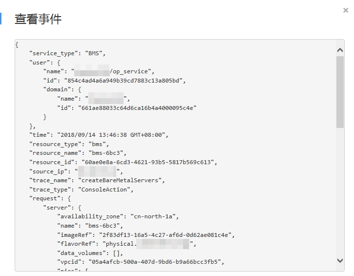

# 查看审计日志

1.  登录管理控制台。
2.  单击“服务列表”，选择“管理与部署 \> 云审计服务”，进入云审计服务信息页面。
3.  单击左侧导航中的“事件列表”，进入事件列表信息页面。
4.  事件列表支持通过筛选来查询对应的操作事件。当前事件列表支持四个维度的组合查询，详细信息如下：
    -   事件来源、资源类型和筛选类型。

        在下拉框中选择查询条件。

        其中，筛选类型选择“按事件名称”时，还需选择某个具体的事件名称；选择“按资源ID”时，还需选择或者手动输入某个具体的资源ID；选择“按资源名称”时，还需选择或手动输入某个具体的资源名称。

    -   操作用户：在下拉框中选择某一具体的操作用户，此操作用户指用户级别，而非租户级别。
    -   事件级别：可选项为“所有事件级别”、“normal”、“warning”、“incident”，只可选择其中一项。
    -   起始时间、结束时间：可通过选择时间段查询操作事件。

5.  在需要查看的记录左侧，单击展开该记录的详细信息。

    **图 1**  展开记录  
    

6.  在需要查看的记录右侧，单击“查看事件”，弹出一个窗口，显示了该操作事件结构的详细信息。

    **图 2**  查看事件  
    

    关于云审计事件结构的关键字段详解，请参见《[云审计服务用户指南](https://support.huaweicloud.com/usermanual-cts/zh-cn_topic_0030598500.html)》。

