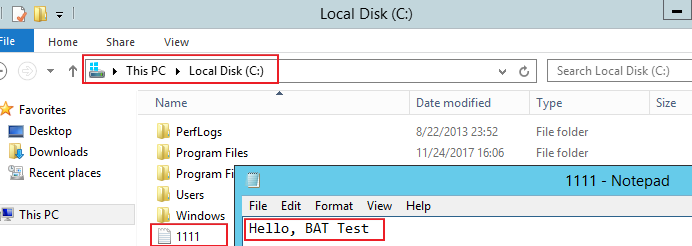

# 用户数据注入<a name="bms_01_0021"></a>

## 使用场景<a name="section114413173019"></a>

当您有如下需求时，可以考虑使用用户数据注入功能来配置裸金属服务器：

-   通过脚本简化裸金属服务器配置
-   通过脚本初始化系统
-   已有脚本，在创建裸金属服务器时一并上传至服务器
-   其他可以使用脚本完成的操作

## 使用限制<a name="section152433348328"></a>

-   Linux：
    -   用于创建裸金属服务器的镜像安装了Cloud-init组件。
    -   用户数据大小限制：小于等于32KB。
    -   如果通过文本方式上传用户数据，数据只能包含ASCII码字符；如果通过文件方式上传用户数据，可以包含任意字符，同时，要求文件大小不能超过32KB。
    -   必须是公共镜像，或继承于公共镜像的私有镜像，或自行安装了Cloud-init组件的私有镜像。
    -   必须满足相应Linux裸金属服务器自定义脚本类型的格式要求。
    -   使用的虚拟私有云必须开启DHCP，安全组出方向规则保证80端口开放。
    -   选择“密码”登录方式时，不支持用户数据注入功能。

-   Windows：
    -   用于创建裸金属服务器的镜像安装了Cloudbase-init组件。
    -   用户数据大小限制：小于等于32KB。
    -   如果通过文本方式上传用户数据，数据只能包含ASCII码字符；如果通过文件方式上传用户数据，可以包含任意字符，同时，要求文件大小不能超过32KB。
    -   必须是公共镜像，或继承于公共镜像的私有镜像，或自行安装了Cloudbase-init组件的私有镜像。
    -   使用的虚拟私有云必须开启DHCP，安全组出方向规则保证80端口开放。


## 使用方法<a name="section1864520172424"></a>

1.  根据实际需要编写用户数据脚本，脚本格式必须符合用户数据脚本规范，详细规范请参见[相关链接](#section1753215178819)。
2.  创建裸金属服务器时，需要将用户数据脚本内容粘贴到“高级配置 \> 现在配置 \> 用户数据注入”的文本框，或者选择用户数据文件上传。

    **图 1**  用户数据注入<a name="fig83475107919"></a>  
    

3.  系统创建裸金属服务器，裸金属服务器启动后自动执行Cloud-init或Cloudbase-init组件，读取用户数据脚本。

## 关于Linux裸金属服务器的用户数据脚本<a name="section197491352211"></a>

Linux裸金属服务器的自定义用户数据脚本（简称“脚本”）采用开源的Cloud-init架构实现，该架构以裸金属服务器的元数据为数据来源，对裸金属服务器进行各项自动化配置。自定义脚本类型兼容开源Cloud-init，详情请参考Cloud-init开源说明：[http://cloudinit.readthedocs.io/en/latest/topics/format.html](http://cloudinit.readthedocs.io/en/latest/topics/format.html)。

-   脚本的执行时间：裸金属服务器的状态变为“running”之后，执行文件“/etc/init”之前。

    > **说明：**   
    >脚本默认以root用户权限执行。  

-   脚本类型：包括“User-Data Script”和“Cloud-Config Data”。

    **表 1**  Linux裸金属服务器脚本类型介绍

    <a name="table039994053718"></a>
    <table><thead align="left"><tr id="row4399194017376"><th class="cellrowborder" valign="top" width="9%" id="mcps1.2.4.1.1"><p id="p1239916402370"><a name="p1239916402370"></a><a name="p1239916402370"></a>-</p>
    </th>
    <th class="cellrowborder" valign="top" width="43%" id="mcps1.2.4.1.2"><p id="p1939914407374"><a name="p1939914407374"></a><a name="p1939914407374"></a>User-Data Script</p>
    </th>
    <th class="cellrowborder" valign="top" width="48%" id="mcps1.2.4.1.3"><p id="p1439913405374"><a name="p1439913405374"></a><a name="p1439913405374"></a>Cloud-Config Data</p>
    </th>
    </tr>
    </thead>
    <tbody><tr id="row3399194012374"><td class="cellrowborder" valign="top" width="9%" headers="mcps1.2.4.1.1 "><p id="p3399174019374"><a name="p3399174019374"></a><a name="p3399174019374"></a>描述</p>
    </td>
    <td class="cellrowborder" valign="top" width="43%" headers="mcps1.2.4.1.2 "><p id="p239984053714"><a name="p239984053714"></a><a name="p239984053714"></a>以脚本作为自定义配置的手段，如shell和python脚本。</p>
    </td>
    <td class="cellrowborder" valign="top" width="48%" headers="mcps1.2.4.1.3 "><p id="p839964053718"><a name="p839964053718"></a><a name="p839964053718"></a>Cloud-init中预定义的对裸金属服务器应用程序进行配置的手段，如yum源、SSH密钥。</p>
    </td>
    </tr>
    <tr id="row73991405372"><td class="cellrowborder" valign="top" width="9%" headers="mcps1.2.4.1.1 "><p id="p1399174073719"><a name="p1399174073719"></a><a name="p1399174073719"></a>格式</p>
    </td>
    <td class="cellrowborder" valign="top" width="43%" headers="mcps1.2.4.1.2 "><p id="p7604786420"><a name="p7604786420"></a><a name="p7604786420"></a>首行必须是<span class="parmvalue" id="parmvalue1560414811420"><a name="parmvalue1560414811420"></a><a name="parmvalue1560414811420"></a>“#!”</span>（如<span class="parmvalue" id="parmvalue136045815424"><a name="parmvalue136045815424"></a><a name="parmvalue136045815424"></a>“#!/bin/bash和#!/usr/bin/env python”</span>）。</p>
    <p id="p173991540123716"><a name="p173991540123716"></a><a name="p173991540123716"></a>首次启动时，将在rc.local-like级别上执行，rc.local-like意味着“在启动序列中非常靠后”。</p>
    </td>
    <td class="cellrowborder" valign="top" width="48%" headers="mcps1.2.4.1.3 "><p id="p113991340193713"><a name="p113991340193713"></a><a name="p113991340193713"></a>首行必须是<span class="parmvalue" id="parmvalue9576171115445"><a name="parmvalue9576171115445"></a><a name="parmvalue9576171115445"></a>“#cloud-config”</span>，且前面不能有空格。</p>
    </td>
    </tr>
    <tr id="row3399114093716"><td class="cellrowborder" valign="top" width="9%" headers="mcps1.2.4.1.1 "><p id="p73991440103715"><a name="p73991440103715"></a><a name="p73991440103715"></a>限制</p>
    </td>
    <td class="cellrowborder" valign="top" width="43%" headers="mcps1.2.4.1.2 "><p id="p7399104013377"><a name="p7399104013377"></a><a name="p7399104013377"></a>在采用Base64编码前，脚本内容（包括首行在内）不能超过32KB。</p>
    </td>
    <td class="cellrowborder" valign="top" width="48%" headers="mcps1.2.4.1.3 "><p id="p5400134023711"><a name="p5400134023711"></a><a name="p5400134023711"></a>在采用Base64编码前，脚本内容（包括首行在内）不能超过32KB。</p>
    </td>
    </tr>
    <tr id="row11400540123715"><td class="cellrowborder" valign="top" width="9%" headers="mcps1.2.4.1.1 "><p id="p7599171419383"><a name="p7599171419383"></a><a name="p7599171419383"></a>频率</p>
    </td>
    <td class="cellrowborder" valign="top" width="43%" headers="mcps1.2.4.1.2 "><p id="p144004404378"><a name="p144004404378"></a><a name="p144004404378"></a>仅在首次启动裸金属服务器时执行一次。</p>
    </td>
    <td class="cellrowborder" valign="top" width="48%" headers="mcps1.2.4.1.3 "><p id="p7400164012372"><a name="p7400164012372"></a><a name="p7400164012372"></a>配置的应用程序不同，执行频率也会不同。</p>
    </td>
    </tr>
    </tbody>
    </table>

-   如何查看注入Linux裸金属服务器的自定义用户数据？
    1.  登录裸金属服务器。
    2.  执行以下命令，以root用户权限查看自定义用户数据。

        **curl** **http://169.254.169.254/openstack/latest/user\_data**


-   脚本使用示例：

    该示例介绍如何以不同格式输入Linux裸金属服务器的脚本，并查看脚本的运行结果。

    **示例一：脚本类型为User-Data** **Script**

    创建裸金属服务器时，选择“文本”形式并输入自定义用户数据脚本，脚本如下：

    ```
    #!/bin/bash
    echo "Hello, the time is now $(date -R)" | tee /root/output.txt
    ```

    创建成功后，连接并启动裸金属服务器，执行命令**cat** _\[file\]_，查看脚本的运行结果。

    ```
    [root@XXXXXXXX ~]# cat /root/output.txt
    Hello, the time is now Mon, 16 Jul 2016 16:03:18+0800
    ```

    **示例二：脚本类型为Cloud-Config** **Data**

    创建裸金属服务器时，选择“文本”形式并输入自定义用户数据脚本，脚本如下：

    ```
    #cloud-config
    bootcmd:
    - echo 192.168.1.130 us.archive.ubuntu.com >> /etc/hosts
    ```

    创建成功后，连接并启动裸金属服务器，执行命令**cat** **/etc/hosts**查看脚本的运行结果。

    **图 2**  查看运行结果<a name="fig1787242875415"></a>  
    


## 关于Windows裸金属服务器的用户数据脚本<a name="section104581829185617"></a>

Windows裸金属服务器的自定义用户数据脚本（简称“脚本”）采用开源的Cloudbase-init架构实现，该架构以裸金属服务器的元数据为数据来源，对裸金属服务器进行各项自动化配置，为Windows裸金属服务器提供执行初始化脚本的能力。自定义脚本类型兼容开源Cloudbase-init，详情请参考Cloudbase-init开源说明：[https://cloudbase-init.readthedocs.io/en/latest/userdata.html](https://cloudbase-init.readthedocs.io/en/latest/userdata.html)。

-   脚本类型：包括“Batch批处理程序”和“PowerShell脚本”。

    **表 2**  Windows裸金属服务器脚本类型介绍

    <a name="table17839134102219"></a>
    <table><thead align="left"><tr id="row168401412224"><th class="cellrowborder" valign="top" width="8.91089108910891%" id="mcps1.2.4.1.1"><p id="p9840194120228"><a name="p9840194120228"></a><a name="p9840194120228"></a>-</p>
    </th>
    <th class="cellrowborder" valign="top" width="43.56435643564357%" id="mcps1.2.4.1.2"><p id="p1584013415223"><a name="p1584013415223"></a><a name="p1584013415223"></a>Batch批处理程序</p>
    </th>
    <th class="cellrowborder" valign="top" width="47.524752475247524%" id="mcps1.2.4.1.3"><p id="p884014192212"><a name="p884014192212"></a><a name="p884014192212"></a>PowerShell脚本</p>
    </th>
    </tr>
    </thead>
    <tbody><tr id="row1384019418223"><td class="cellrowborder" valign="top" width="8.91089108910891%" headers="mcps1.2.4.1.1 "><p id="p784064142212"><a name="p784064142212"></a><a name="p784064142212"></a>格式</p>
    </td>
    <td class="cellrowborder" valign="top" width="43.56435643564357%" headers="mcps1.2.4.1.2 "><p id="p984016414220"><a name="p984016414220"></a><a name="p984016414220"></a>以<span class="parmvalue" id="parmvalue10976115811236"><a name="parmvalue10976115811236"></a><a name="parmvalue10976115811236"></a>“rem cmd”</span>开头且作为首行，且前面不能有空格。</p>
    </td>
    <td class="cellrowborder" valign="top" width="47.524752475247524%" headers="mcps1.2.4.1.3 "><p id="p138409411221"><a name="p138409411221"></a><a name="p138409411221"></a>以<span class="parmvalue" id="parmvalue17450145257"><a name="parmvalue17450145257"></a><a name="parmvalue17450145257"></a>“#ps1”</span>开头且作为首行，且前面不能有空格。</p>
    </td>
    </tr>
    <tr id="row11840841202215"><td class="cellrowborder" valign="top" width="8.91089108910891%" headers="mcps1.2.4.1.1 "><p id="p1840174162220"><a name="p1840174162220"></a><a name="p1840174162220"></a>限制</p>
    </td>
    <td class="cellrowborder" valign="top" width="43.56435643564357%" headers="mcps1.2.4.1.2 "><p id="p19840184112223"><a name="p19840184112223"></a><a name="p19840184112223"></a>在采用Base64编码前，脚本内容（包括首行在内）不能超过32KB。</p>
    </td>
    <td class="cellrowborder" valign="top" width="47.524752475247524%" headers="mcps1.2.4.1.3 "><p id="p384017415229"><a name="p384017415229"></a><a name="p384017415229"></a>在采用Base64编码前，脚本内容（包括首行在内）不能超过32KB。</p>
    </td>
    </tr>
    </tbody>
    </table>

-   如何查看注入Windows裸金属服务器的自定义用户数据？
    1.  登录裸金属服务器。
    2.  在浏览器栏访问如下地址，查看注入的用户数据。

        **http://169.254.169.254/openstack/latest/user\_data**


-   脚本使用示例

    该示例介绍如何以不同格式输入Windows裸金属服务器的脚本，并查看脚本的运行结果。

    **示例一：Batch批处理程序**

    创建裸金属服务器时，选择“文本”形式并输入自定义用户数据脚本，脚本如下：

    ```
    rem cmd
    echo "Hello, BAT Test" > C:\1111.txt
    ```

    创建成功后，连接并启动裸金属服务器，查看脚本的运行结果：在C:\\盘添加了一个名称为 “1111” 的文本文档，如[图3](#fig8622411077)所示。

    **图 3**  新建文本文档1111<a name="fig8622411077"></a>  
    

    如需查看注入Windows裸金属服务器的用户数据，可以在浏览器访问：http://169.254.169.254/openstack/latest/user\_data，如[图4](#fig14281122141212)所示。

    **图 4**  查看用户数据1111<a name="fig14281122141212"></a>  
    

    **示例二：PowerShell脚本**

    创建裸金属服务器时，选择“文本”形式并输入自定义用户数据脚本，脚本如下：

    ```
    #ps1
    echo "Hello, Powershell Test" > C:\aaaa.txt
    ```

    创建成功后，连接并启动裸金属服务器，查看脚本的运行结果：在C:\\盘添加了一个名称为 “aaaa” 的文本文档。

    **图 5**  新建文本文档aaaa<a name="fig103618447159"></a>  
    

    如需查看注入Windows裸金属服务器的用户数据，可以在浏览器访问：http://169.254.169.254/openstack/latest/user\_data，如[图6](#fig124617204176)所示。

    **图 6**  查看用户数据aaaa<a name="fig124617204176"></a>  
    


## 案例1<a name="section6298124315470"></a>

该案例介绍如何通过用户数据注入，简化裸金属服务器配置。

当您需要设置vim的“语法高亮显示”、“制表符占用4个空格”和“显示行数”属性时，就可以写一个脚本vimrc，并将其注入到“/root/.vimrc”。在您创建完裸金属服务器时，您的vim配置便完成了。这样做可以大幅提高系统配置的效率，特别是在您一次性创建多台裸金属服务器时。

用户数据注入示例：

```
#cloud-config
write_files:
  - path: /root/.vimrc
    content: |
      syntax on
      set tabstop=4
      set number      
```

## 案例2<a name="section93711419175416"></a>

该案例介绍如何通过用户数据注入，重置Linux裸金属服务器密码。

假设您需要将root用户密码重置为“\*\*\*\*\*\*”。

> **说明：**   
>新密码必须符合密码复杂度要求，密码规则如[表3](#table17998105810568)所示。  

**表 3**  密码规则

<a name="table17998105810568"></a>
<table><thead align="left"><tr id="row169981758195617"><th class="cellrowborder" valign="top" width="20%" id="mcps1.2.4.1.1"><p id="p18998155814569"><a name="p18998155814569"></a><a name="p18998155814569"></a>参数</p>
</th>
<th class="cellrowborder" valign="top" width="60%" id="mcps1.2.4.1.2"><p id="p299925805610"><a name="p299925805610"></a><a name="p299925805610"></a>规则</p>
</th>
<th class="cellrowborder" valign="top" width="20%" id="mcps1.2.4.1.3"><p id="p69991585565"><a name="p69991585565"></a><a name="p69991585565"></a>样例</p>
</th>
</tr>
</thead>
<tbody><tr id="row11999115816565"><td class="cellrowborder" valign="top" width="20%" headers="mcps1.2.4.1.1 "><p id="p199975816561"><a name="p199975816561"></a><a name="p199975816561"></a>密码</p>
</td>
<td class="cellrowborder" valign="top" width="60%" headers="mcps1.2.4.1.2 "><a name="ul887614358573"></a><a name="ul887614358573"></a><ul id="ul887614358573"><li>密码长度范围为8到26位。</li><li>密码至少包含以下4种字符中的3种：<a name="ul16512152335816"></a><a name="ul16512152335816"></a><ul id="ul16512152335816"><li>大写字母</li><li>小写字母</li><li>数字</li><li>特殊字符，包括!@$%^-_=+[]{}:,./?</li></ul>
</li><li>密码不能包含用户名或用户名的逆序。</li><li>Windows系统的裸金属服务器，不能包含用户名中超过两个连续字符的部分。</li></ul>
</td>
<td class="cellrowborder" valign="top" width="20%" headers="mcps1.2.4.1.3 "><p id="p699916580568"><a name="p699916580568"></a><a name="p699916580568"></a>Test12$@</p>
</td>
</tr>
</tbody>
</table>

用户数据注入示例（请严格遵守下面示例中的缩进标准）：

```
#cloud-config
chpasswd:
  list: |
    root:******
  expire: False
```

裸金属服务器创建成功后，您可以使用重置的密码登录裸金属服务器。为了保证密码安全，建议您在第一次登录裸金属服务器后，修改root用户密码。

## 案例3<a name="section12403842045"></a>

该案例介绍如何通过用户数据注入，为Windows裸金属服务器新增用户并设置密码。

假设您要创建的用户名为“abc”、密码为“\*\*\*\*\*\*”普通用户，并将其添加至administrators用户组。

> **说明：**   
>新密码必须符合密码复杂度要求，密码规则如[表4](#table82807424619)所示。  

**表 4**  密码规则

<a name="table82807424619"></a>
<table><thead align="left"><tr id="bms_01_0021_row169981758195617"><th class="cellrowborder" valign="top" width="20%" id="mcps1.2.4.1.1"><p id="bms_01_0021_p18998155814569"><a name="bms_01_0021_p18998155814569"></a><a name="bms_01_0021_p18998155814569"></a>参数</p>
</th>
<th class="cellrowborder" valign="top" width="60%" id="mcps1.2.4.1.2"><p id="bms_01_0021_p299925805610"><a name="bms_01_0021_p299925805610"></a><a name="bms_01_0021_p299925805610"></a>规则</p>
</th>
<th class="cellrowborder" valign="top" width="20%" id="mcps1.2.4.1.3"><p id="bms_01_0021_p69991585565"><a name="bms_01_0021_p69991585565"></a><a name="bms_01_0021_p69991585565"></a>样例</p>
</th>
</tr>
</thead>
<tbody><tr id="bms_01_0021_row11999115816565"><td class="cellrowborder" valign="top" width="20%" headers="mcps1.2.4.1.1 "><p id="bms_01_0021_p199975816561"><a name="bms_01_0021_p199975816561"></a><a name="bms_01_0021_p199975816561"></a>密码</p>
</td>
<td class="cellrowborder" valign="top" width="60%" headers="mcps1.2.4.1.2 "><a name="bms_01_0021_ul887614358573"></a><a name="bms_01_0021_ul887614358573"></a><ul id="bms_01_0021_ul887614358573"><li>密码长度范围为8到26位。</li><li>密码至少包含以下4种字符中的3种：<a name="bms_01_0021_ul16512152335816"></a><a name="bms_01_0021_ul16512152335816"></a><ul id="bms_01_0021_ul16512152335816"><li>大写字母</li><li>小写字母</li><li>数字</li><li>特殊字符，包括!@$%^-_=+[]{}:,./?</li></ul>
</li><li>密码不能包含用户名或用户名的逆序。</li><li>Windows系统的裸金属服务器，不能包含用户名中超过两个连续字符的部分。</li></ul>
</td>
<td class="cellrowborder" valign="top" width="20%" headers="mcps1.2.4.1.3 "><p id="bms_01_0021_p699916580568"><a name="bms_01_0021_p699916580568"></a><a name="bms_01_0021_p699916580568"></a>Test12$@</p>
</td>
</tr>
</tbody>
</table>

用户数据注入示例：

```
rem cmd
net user abc ****** /add
net localgroup administrators abc /add
```

裸金属服务器创建成功后，您可以使用新创建的用户名和密码登录裸金属服务器。

## 案例4<a name="section9250241316"></a>

该案例介绍如何通过用户数据注入，为Linux裸金属服务器更新系统软件包，并且开启httpd相关服务。注入成功后，您的裸金属服务器就可以使用httpd服务了。

用户数据注入示例：

```
#!/bin/bash
yum update -y
service httpd start
chkconfig httpd on
```

## 案例5<a name="section1053071411620"></a>

该案例介绍如何通过用户数据注入，激活Linux裸金属服务器的root用户远程登录权限。注入成功后，您可以使用SSH密钥方式，以root帐户登录裸金属服务器。

用户数据注入示例：

```
#cloud-config
disable_root: false
runcmd:
- sed -i 's/^PermitRootLogin.*$/PermitRootLogin without-password/' /etc/ssh/sshd_config
- sed -i '/^KexAlgorithms.*$/d' /etc/ssh/sshd_config
- service sshd restart
```

## 相关链接<a name="section1753215178819"></a>

更多关于用户数据注入案例的介绍，请参阅Cloud-init/Cloudbase-init官网：

-   [https://cloudinit.readthedocs.io/en/latest/](https://cloudinit.readthedocs.io/en/latest/)

-   [https://cloudbase-init.readthedocs.io/en/latest/](https://cloudbase-init.readthedocs.io/en/latest/)

