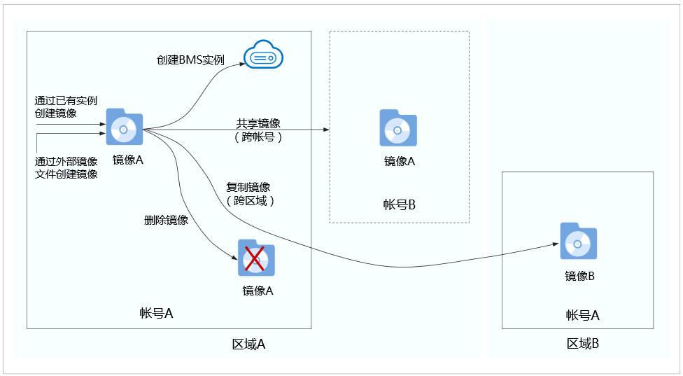

# 私有镜像概述

私有镜像包含操作系统、预装的公共应用以及用户的私有应用，仅用户个人可见。您可以通过以下方式创建私有镜像：

-   [通过裸金属服务器创建私有镜像](通过裸金属服务器创建私有镜像.md)

    > **说明：**   
    >当前仅支持快速发放型裸金属服务器（操作系统安装在云硬盘中）来创建私有镜像。  

-   [通过外部镜像文件创建私有镜像](通过外部镜像文件创建私有镜像.md)

    用户可以上传外部镜像文件并将镜像注册到云平台上，成为自己的私有镜像。目前支持的外部镜像文件格式包括：VMDK、VHD、QCOW2、RAW、VHDX、QED、VDI、QCOW、ZVHD2和ZVHD。

    > **说明：**   
    >其他格式的镜像文件需要预先[使用工具转换镜像格式](镜像格式转换.md)后，才能运行在裸金属服务器中。  

当您成功创建私有镜像后，镜像的状态为“正常”。此时，您可以使用该镜像新建裸金属服务器实例，也可以将其共享给其他用户，还可以复制到您帐号下的其他区域。下图总结了私有镜像常见的使用方式：

**图 1**  私有镜像使用方式  

