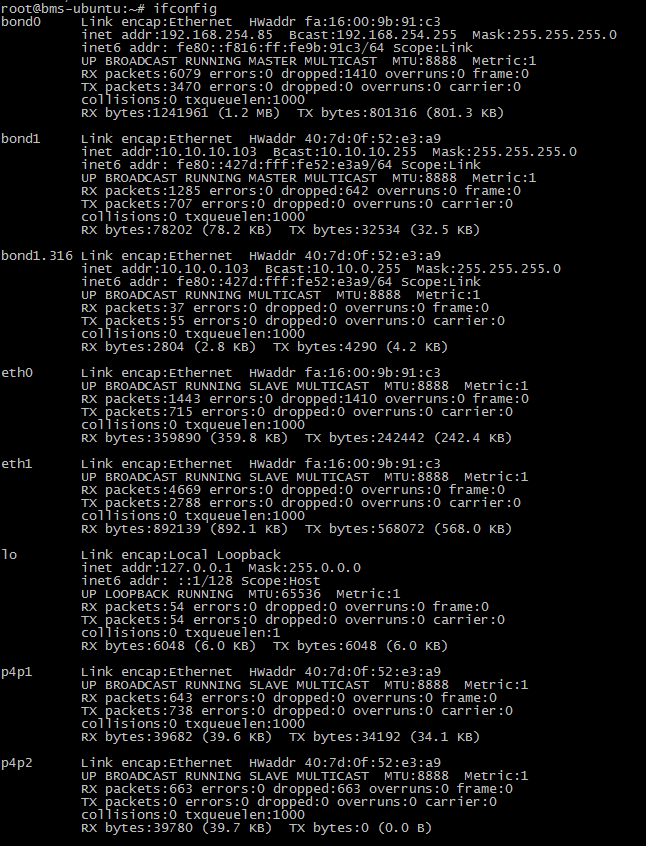

# 配置增强高速网卡（Ubuntu系列）<a name="bms_01_0074"></a>

下面以Ubuntu 16.04 LTS \(Xenial Xerus x86\_64\)操作系统为例，举例介绍裸金属服务器增强高速网卡的bond配置方法：

> **说明：**   
>Ubuntu系列其他操作系统的配置方法与Ubuntu 16.04 LTS \(Xenial Xerus x86\_64\)类似。  

## 增加网卡<a name="section425191716477"></a>

1.  以“root”用户，使用密钥或密码登录裸金属服务器。
2.  <a name="li0616194735713"></a>进入裸金属服务器的命令行界面，查询网卡信息。

    **ip** **link**

    返回信息示例如下：

    ```
    1: lo: <LOOPBACK,UP,LOWER_UP> mtu 65536 qdisc noqueue state UNKNOWN group default qlen 1
        link/loopback 00:00:00:00:00:00 brd 00:00:00:00:00:00
        inet 127.0.0.1/8 scope host lo
           valid_lft forever preferred_lft forever
        inet6 ::1/128 scope host 
           valid_lft forever preferred_lft forever
    2: eth0: <BROADCAST,MULTICAST,SLAVE,UP,LOWER_UP> mtu 8888 qdisc mq master bond0 state UP group default qlen 1000
        link/ether fa:16:00:9b:91:c3 brd ff:ff:ff:ff:ff:ff
    3: eth1: <BROADCAST,MULTICAST,SLAVE,UP,LOWER_UP> mtu 8888 qdisc mq master bond0 state UP group default qlen 1000
        link/ether fa:16:00:9b:91:c3 brd ff:ff:ff:ff:ff:ff
    4: p5p1: <BROADCAST,MULTICAST> mtu 1500 qdisc noop state DOWN group default qlen 1000
        link/ether 40:7d:0f:52:e4:1d brd ff:ff:ff:ff:ff:ff
    5: p5p2: <BROADCAST,MULTICAST> mtu 1500 qdisc noop state DOWN group default qlen 1000
        link/ether 40:7d:0f:52:e4:1e brd ff:ff:ff:ff:ff:ff
    6: p4p1: <BROADCAST,MULTICAST> mtu 1500 qdisc noop state DOWN group default qlen 1000
        link/ether 40:7d:0f:52:e3:a9 brd ff:ff:ff:ff:ff:ff
    7: p4p2: <BROADCAST,MULTICAST> mtu 1500 qdisc noop state DOWN group default qlen 1000
        link/ether 40:7d:0f:52:e3:aa brd ff:ff:ff:ff:ff:ff
    8: bond0: <BROADCAST,MULTICAST,MASTER,UP,LOWER_UP> mtu 8888 qdisc noqueue state UP group default qlen 1000
        link/ether fa:16:00:9b:91:c3 brd ff:ff:ff:ff:ff:ff
        inet 192.168.254.85/24 brd 192.168.254.255 scope global bond0
           valid_lft forever preferred_lft forever
        inet6 fe80::f816:ff:fe9b:91c3/64 scope link 
           valid_lft forever preferred_lft forever
    9: bond0.3157@bond0: <BROADCAST,MULTICAST,UP,LOWER_UP> mtu 8888 qdisc noqueue state UP group default qlen 1000
        link/ether fa:16:00:9c:1e:79 brd ff:ff:ff:ff:ff:ff
        inet 192.168.100.14/24 brd 192.168.100.255 scope global bond0.3157
           valid_lft forever preferred_lft forever
        inet6 fe80::f816:ff:fe9c:1e79/64 scope link 
           valid_lft forever preferred_lft forever
    10: bond0.3159@bond0: <BROADCAST,MULTICAST,UP,LOWER_UP> mtu 8888 qdisc noqueue state UP group default qlen 1000
        link/ether fa:16:00:0a:2e:8e brd ff:ff:ff:ff:ff:ff
        inet 192.168.101.153/24 brd 192.168.101.255 scope global bond0.3159
           valid_lft forever preferred_lft forever
        inet6 fe80::f816:ff:fe0a:2e8e/64 scope link 
           valid_lft forever preferred_lft forever
    ```

    > **说明：**   
    >其中，“eth0”和“eth1”为承载VPC网络的网络设备，“p5p1”、“p5p2”、“p4p1”和“p4p2”为承载增强高速网络的网络设备。下面步骤将使用“p4p1”和“p4p2”配置增强高速网卡bond。  

3.  执行以下命令，查看“/etc/udev/rules.d/”目录下是否有“80-persistent-net.rules”配置文件。

    **ll** **/etc/udev/rules.d/** **|** **grep** **80-persistent-net.rules**

    -   如果存在“80-persistent-net.rules”，且该配置文件中已存在[2](#li0616194735713)中查询到的除“bond0”和“lo”以外的其它所有网卡和对应的MAC地址，请执行[6](#li283725272415)。
    -   否则，继续执行[4](#li116366367312)。

4.  <a name="li116366367312"></a>执行以下命令，将“/etc/udev/rules.d/70-persistent-net.rules”文件拷贝一份（文件名为“/etc/udev/rules.d/80-persistent-net.rules”）。

    **cp** **-p** **/etc/udev/rules.d/70-persistent-net.rules** **/etc/udev/rules.d/80-persistent-net.rules**

5.  设置udev规则。

    将[2](#li0616194735713)中查询到的除“lo”、“eth0”、“eth1”和“bond0”以外的网卡和MAC对应关系添加到“/etc/udev/rules.d/80-persistent-net.rules”文件中，使得裸金属服务器重启复位后，网卡名称和顺序不会发生改变。

    > **说明：**   
    >网卡的MAC地址和名称中的字母，请使用小写字母。  

    **vim** **/etc/udev/rules.d/80-persistent-net.rules**

    修改后的示例如下：

    ```
    SUBSYSTEM=="net", ACTION=="add", DRIVERS=="?*", ATTR{address}=="f4:4c:7f:5d:b6:fc", NAME="eth0"
    SUBSYSTEM=="net", ACTION=="add", DRIVERS=="?*", ATTR{address}=="f4:4c:7f:5d:b6:fd", NAME="eth1"
    SUBSYSTEM=="net", ACTION=="add", DRIVERS=="?*", ATTR{address}=="40:7d:0f:52:e4:1d", NAME="p5p1"
    SUBSYSTEM=="net", ACTION=="add", DRIVERS=="?*", ATTR{address}=="40:7d:0f:52:e4:1e", NAME="p5p2"
    SUBSYSTEM=="net", ACTION=="add", DRIVERS=="?*", ATTR{address}=="40:7d:0f:52:e3:a9", NAME="p4p1"
    SUBSYSTEM=="net", ACTION=="add", DRIVERS=="?*", ATTR{address}=="40:7d:0f:52:e3:aa", NAME="p4p2"
    ```

    修改完成后，按“Esc”，输入**:wq**保存并退出。

6.  <a name="li283725272415"></a>执行以下命令，将网卡配置文件“/etc/network/interfaces.d/50-cloud-init.cfg”拷贝为“/etc/network/interfaces.d/60-cloud-init.cfg”。

    **cp** **-p** **/etc/network/interfaces.d/50-cloud-init.cfg** **/etc/network/interfaces.d/60-cloud-init.cfg**

    > **说明：**   
    >如果没有“/etc/network/interfaces.d/50-cloud-init.cfg”文件，请拷贝“/etc/network/interfaces”文件，依次执行以下命令：  
    >**mkdir** **/etc/network/interfaces.d**  
    >**cp** **-p** **/etc/network/interfaces** **/etc/network/interfaces.d/60-cloud-init.cfg**  

7.  执行以下命令，编辑“/etc/network/interfaces.d/60-cloud-init.cfg”，配置“p4p1”设备和“p4p2”设备的网络配置文件“/etc/network/interfaces.d/60-cloud-init.cfg”。

    **vim** **/etc/network/interfaces.d/60-cloud-init.cfg**

    按如下格式编辑：

    ```
    auto p4p1
    iface p4p1 inet manual
    bond_mode 1
    bond-master bond1
    bond_miimon 100
    mtu 8888
    
    auto p4p2
    iface p4p2 inet manual
    bond_mode 1
    bond-master bond1
    bond_miimon 100
    mtu 8888
    
    auto bond1
    iface bond1 inet static
    bond_miimon 100
    bond-slaves none
    bond_mode 1
    address 10.10.10.103
    netmask 255.255.255.0
    hwaddress 40:7d:0f:52:e3:a9
    mtu 8888
    ```

    其中，

    -   “p4p1”和“p4p2”为承载增强高速网络配置的网卡名称。
    -   “hwaddress”为“p4p1”设备对应的MAC地址。
    -   “address”的取值为给增强高速网络“bond1”配置的IP（给增强高速网络规划的IP地址在没有与VPC网段冲突的情况下可任意规划，需要通过增强高速网络通信的裸金属服务器须将增强高速网络配置在同一个网段）。
    -   “netmask”的取值为给增强高速网络“bond1”配置的IP的掩码。

    各个设备的其他参数可参考如上信息进行配置，如“mtu”配置为“8888”，“bond\_miimon”配置为“100”，“bond\_mode”配置为“1”等。

    修改完成后，按“Esc”，输入**:wq**保存并退出。

8.  执行以下命令，启动bond网卡。

    **ifup** _p4p1_

    **ifup** _p4p2_

    > **说明：**   
    >其中，“p4p1”和“p4p2”分别为承载增强高速网络的网卡。  

9.  执行以下命令，查看网卡设备的状态和“bond1”配置文件是否生效。

    **ip** **link**

    

    **ifconfig**

    

10. 参见上述步骤，完成其他裸金属服务器的配置。
11. 待其他裸金属服务器配置完成后，互相ping对端增强高速网络配置的同网段IP，检查是否可以ping通。

    **ping** **10.10.10.102**，返回如下：

    ```
    [root@bms-ubuntu ~]# ping 10.10.10.102 -I bond1
    PING 10.10.10.102 (10.10.10.102) from 10.10.10.103 bond1: 56(84) bytes of data.
    64 bytes from 10.10.10.102: icmp_seq=1 ttl=64 time=0.681 ms
    64 bytes from 10.10.10.102: icmp_seq=2 ttl=64 time=0.035 ms
    64 bytes from 10.10.10.102: icmp_seq=3 ttl=64 time=0.031 ms
    64 bytes from 10.10.10.102: icmp_seq=4 ttl=64 time=0.030 ms
    ^C
    --- 10.10.10.102 ping statistics ---
    4 packets transmitted, 4 received, 0% packet loss, time 3342ms
    ```


**如果需要配置VLAN，则按照以下步骤配置。**

1.  根据需要配置的VLAN，配置相应VLAN子接口。假设VLAN为316，执行以下命令，编辑“/etc/network/interfaces.d/60-cloud-init.cfg”。

    **vim** **/etc/network/interfaces.d/60-cloud-init.cfg**

    按以下格式编辑：

    ```
    auto p4p1
    iface p4p1 inet manual
    bond_mode 1
    bond-master bond1
    bond_miimon 100
    mtu 8888
    
    auto p4p2
    iface p4p2 inet manual
    bond_mode 1
    bond-master bond1
    bond_miimon 100
    mtu 8888
    
    auto bond1
    iface bond1 inet static
    bond_miimon 100
    bond-slaves none
    bond_mode 1
    address 10.10.10.103
    netmask 255.255.255.0
    hwaddress 40:7d:0f:52:e3:a9
    mtu 8888
    
    auto bond1.316
    iface bond1.316 inet static
    bond_miimon 100
    bond-slaves none
    bond_mode 1
    address 10.10.0.103
    netmask 255.255.255.0
    hwaddress 40:7d:0f:52:e3:a9
    mtu 8888
    ```

2.  执行以下命令，启动bond网卡VLAN子接口。

    **ifup** _bond1.316_

3.  待其他裸金属服务器配置完成后，互相ping对端增强高速网络VLAN子接口的同网段IP，检查是否可以ping通。

    .png)


## 删除网卡<a name="section17427175114209"></a>

1.  获取待删除增强高速网卡的bond网卡地址。
2.  以“root”用户，使用密钥或密码登录裸金属服务器。
3.  找到bond关联的网络设备，然后执行命令关闭并删除网络设备。如果bond有VLAN子接口，这一步将自动删除VLAN子接口。

    ```
    [root@bms-ubuntu ~]# ifdown p4p1
    [root@bms-ubuntu ~]# ifdown p4p2
    [root@bms-ubuntu ~]# ifdown bond1
    ```

4.  执行以下命令，删除网络配置文件“/etc/network/interfaces.d/60-cloud-init.cfg”。

    **rm** **-f** **/etc/network/interfaces.d/60-cloud-init.cfg**


