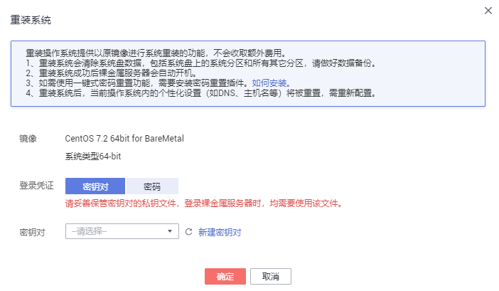

# 重装裸金属服务器的操作系统

## 操作场景

裸金属服务器操作系统无法正常启动，操作系统中毒，或裸金属服务器系统运行正常，但需要对系统进行优化，使其在最优状态下工作时，用户可以使用重装裸金属服务器的操作系统功能。

## 重装须知

-   支持对本地磁盘发放和快速发放裸金属服务器的系统进行重装。
-   重装过程中禁止对裸金属服务器进行关机或重启等操作。
-   重装操作系统成功后，裸金属服务器会自动开机。

## 约束与限制

-   仅支持同一个操作系统重装。
-   如果裸金属服务器的启动设备为云硬盘，需确保云硬盘的配额大于0。
-   如果是通过私有镜像创建的裸金属服务器，请确保原有镜像仍存在。
-   重装系统界面不支持本地磁盘裸金属服务器的系统盘容量显示。
-   对于快速发放裸金属服务器，重装过程中，如果操作系统所在的EVS盘被删除，则重装失败。
-   重装过程不支持更改许可证类型，也不支持用户数据注入。

## 前提条件

-   待重装操作系统的裸金属服务器需处于“关机”状态。
-   待重装操作系统的快速发放裸金属服务器挂载有系统盘。
-   重装操作系统会清除系统盘数据，包括系统盘上的系统分区和所有其他分区，请做好数据备份。
-   重装系统依赖于裸金属服务器镜像中的bms-network-config和Cloud-init插件。
    -   如果待重装系统的裸金属服务器使用的是公共镜像，镜像中已内置bms-network-config和Cloud-init插件。
    -   如果待重装系统的裸金属服务器使用的是私有镜像，请参考《裸金属服务器私有镜像制作指南》确认是否已安装配置bms-network-config和Cloud-init插件。

## 操作步骤

1.  登录管理控制台。
2.  单击管理控制台左上角的，选择地域和项目。
3.  选择“计算 \> 裸金属服务器”。

    进入裸金属服务器页面。

4.  在待重装操作系统的裸金属服务器的“操作”列下，单击“更多 \> 重装系统”。

    进入“重装系统”界面。

    **图 1**  重装系统  
    

5.  设置登录方式。

    -   密钥对：您可以选择已有密钥对，或单击“查看密钥对”新建一个密钥对作为登录裸金属服务器的私钥。
    -   密码：您可以设置操作系统的初始登录密码。密码必须符合密码复杂度要求，密码规则如[表1](用户数据注入（可选）.md#table17998105810568)所示。

    > **说明：**   
    >Windows操作系统只支持设置密钥登录。  

6.  单击“确定”。
7.  在“裸金属服务器重装系统”页面，确认重装的操作系统规格无误后，单击“提交申请”。

    提交重装系统的申请后，裸金属服务器的状态变为“重装中”，当该状态消失后，表示重装结束。

    > **说明：**   
    >在重装操作系统过程中请不要对该裸金属服务器进行任何操作。  

8.  （可选）如果裸金属服务器在重装操作系统前已配置QinQ网络，重装完成后请参考[自定义VLAN网络](自定义VLAN网络.md)重新配置网络。

